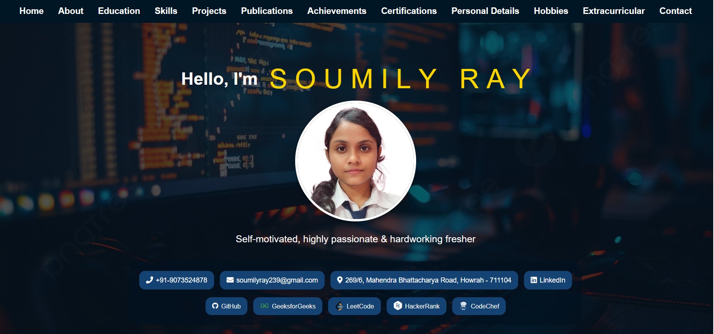
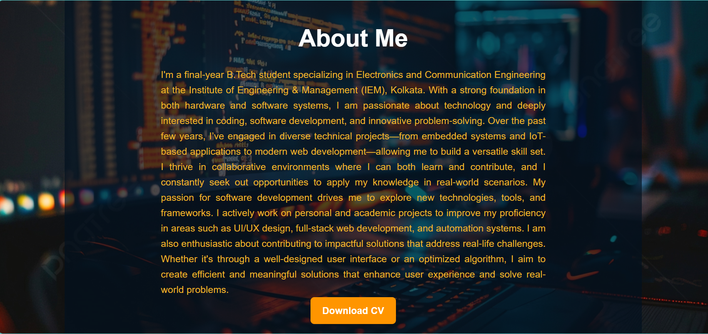
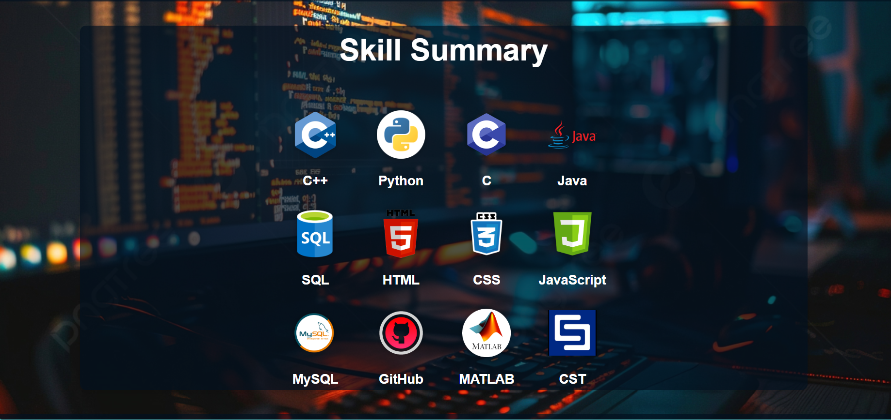

# Portfolio-SOUMILY
# 🌐 Personal Portfolio – Soumily Ray

Welcome to my personal portfolio website! I'm a final-year B.Tech student specializing in Electronics and Communication Engineering at the Institute of Engineering & Management (IEM), Kolkata. This portfolio showcases my academic journey, technical projects, skills, and hobbies.

## 🔍 Overview

This website was built to reflect who I am as an aspiring engineer. It includes:

- A brief about me
- Technical projects 
- Skills and achievements
- A hobbies section with visuals
- Downloadable resume (CV)
- Contact links 

## 🛠️ Technologies Used

- **HTML5**
- **CSS3**
- **JavaScript** (for interactivity, if added)
- **Font Awesome** (for icons)
  ## 📷 Preview

## 📷 Website Previews

  
  

## 📁 Folder Structure
portfolio/
├── index.html # Main HTML page
├── style.css # Custom styles
├── # Logos, icons, or photos
│ ├── dancing.png
│ └── painting.png
├── cv/
│ └── Soumily_Ray_CV.pdf # Downloadable resume
├── README.md # This file
